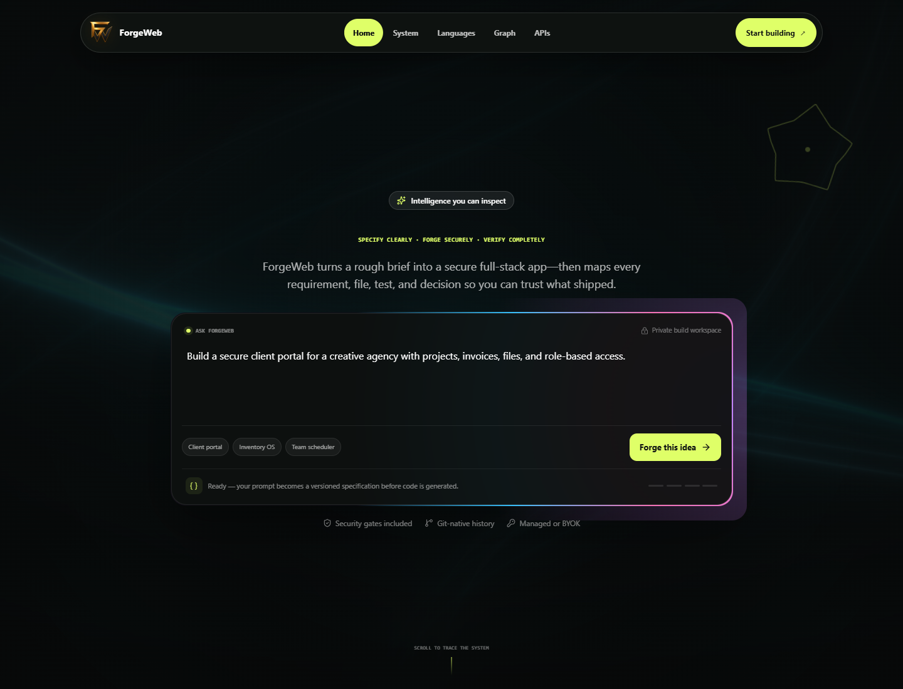
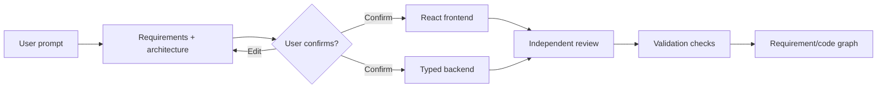

# ForgeWeb

ForgeWeb is an architecture-first, full-stack application generator. A user describes a product, reviews the generated requirements and `ARCHITECTURE.md`, explicitly confirms the plan, and only then does ForgeWeb generate the customer's React frontend and typed backend.



## What works today

- Prompt-to-requirements compilation with stable requirement IDs.
- Prompt-specific architecture covering frontend, backend, data, security, delivery, and system boundaries.
- A hard `awaiting_confirmation` gate: no source files exist before approval.
- React and TypeScript customer-application generation.
- Typed Node.js backend contracts, role/ownership policy, and audit envelopes.
- Customer-app capability planning for React, Git, GSAP, Anime.js, and reviewed React Bits patterns.
- Karpathy-derived coding discipline and gstack-informed bounded specialist tasks.
- Independent scope and traceability review.
- Deterministic validation and a requirement-to-file evidence graph.
- Persistent local projects, immutable version snapshots, and safe restore in an atomic JSON store.
- A real sandboxed preview generated from the approved project specification, with desktop, tablet, and mobile controls.
- Prompt-scoped project edits that validate before creating a new version and preserve the last working version on failure.
- Generated-application database information kept separate from ForgeWeb's control-plane storage.
- Validation-gated ZIP export containing the actual files from the selected project version.
- Responsive animated ForgeWeb interface with reduced-motion behavior.

## Generation flow



The confirmation boundary is enforced by the backend state machine. It is not merely a disabled frontend button.

## Technology

| Area | Technology |
|---|---|
| Platform UI | React 19, TypeScript, Vite, Tailwind CSS |
| Motion | GSAP, Anime.js, Motion, Three.js/OGL |
| Control plane | Node.js, TypeScript, native HTTP server |
| Persistence | Atomic local JSON store |
| Validation | Node test runner, TypeScript, custom UI audit with Playwright |
| Generated apps | React/TypeScript frontend and typed Node.js backend artifacts |

## Requirements

- Node.js 22 or newer
- pnpm 10 or newer
- Google Chrome only when running the optional visual UI audit

If pnpm is not installed:

```powershell
corepack enable
corepack prepare pnpm@latest --activate
```

## Quick start

```powershell
git clone https://github.com/Sachin71000/forgeweb.git
cd forgeweb
pnpm install
pnpm dev
```

Open [http://127.0.0.1:5173](http://127.0.0.1:5173).

`pnpm dev` starts both the Vite frontend and the local ForgeWeb API. A second terminal is not required.

## How to use it

1. Enter an application idea in the central prompt box.
2. Select **Forge this idea**.
3. Review the generated requirements, architecture summary, capability sources, and `ARCHITECTURE.md`.
4. Select **Confirm requirements & generate**.
5. Watch frontend generation, backend generation, review, validation, and graph synchronization complete.
6. Switch between **Files**, **Preview**, **Database**, and **Versions** in the generated project workspace.
7. Use **Edit with AI** for a scoped change, restore any prior version, or validate and create a ZIP.
8. Reload the page and use **My Projects** to reopen the persisted workspace.

Local state is stored at `.forgeweb-data/forgeweb.json`. The directory is ignored by Git.

## Commands

| Command | Purpose |
|---|---|
| `pnpm dev` | Start the frontend and embedded development API at `127.0.0.1:5173` |
| `pnpm typecheck` | Type-check the frontend and server |
| `pnpm test` | Run workflow, policy, persistence, and HTTP tests |
| `pnpm build` | Build the production frontend and compiled API |
| `pnpm preview` | Preview the production frontend build |
| `pnpm dev:api` | Run only the TypeScript API on port `8787` |
| `pnpm build:api` | Compile only the server into `dist-server` |
| `pnpm start:api` | Run the compiled API |
| `node scripts/ui-audit.cjs` | Run responsive, accessibility, interaction, motion, and WebGL browser checks |

Recommended verification before committing:

```powershell
pnpm typecheck
pnpm test
pnpm build
```

Optional full browser audit, after starting `pnpm dev`:

```powershell
node scripts/ui-audit.cjs
```

## HTTP API

| Method | Route | Purpose |
|---|---|---|
| `GET` | `/api/health` | Control-plane readiness |
| `POST` | `/api/builds` | Create requirements and architecture from `{ "prompt": "..." }` |
| `GET` | `/api/builds/:buildId` | Read build stage, proposal, evidence, and events |
| `POST` | `/api/builds/:buildId/confirm` | Approve the proposal and begin source generation |
| `GET` | `/api/builds/:buildId/events` | Stream auditable progress through server-sent events |
| `GET` | `/api/projects` | List persisted projects |
| `GET` | `/api/projects/:projectId` | Read project, specification, generated files, and graph |
| `GET` | `/api/projects/:projectId/workspace` | Read current version, source, version history, and generated database information |
| `GET` | `/api/projects/:projectId/preview` | Render the current stored preview with restrictive isolation headers |
| `POST` | `/api/projects/:projectId/edits` | Validate and apply a scoped edit as a new immutable version |
| `POST` | `/api/projects/:projectId/versions/:versionId/restore` | Restore a validated version |
| `POST` | `/api/projects/:projectId/export/validate` | Validate the current version and return its export summary |
| `POST` | `/api/projects/:projectId/export` | Download a real ZIP of the current version |

Example:

```powershell
$proposal = Invoke-RestMethod `
  -Method Post `
  -Uri http://127.0.0.1:5173/api/builds `
  -ContentType application/json `
  -Body '{"prompt":"Build a secure client portal with projects, invoices, files, and role-based access."}'

$buildId = $proposal.build.id
Invoke-RestMethod -Method Post -Uri "http://127.0.0.1:5173/api/builds/$buildId/confirm"
```

## Repository structure

```text
src/                         ForgeWeb React interface
  components/                Product and reviewed visual components
  lib/forgeweb-api.ts        Typed browser API client
server/                      Local generation control plane
  workflow.ts                Architecture and confirmation state machine
  project-workspace.ts       Preview, scoped edit, version, restore, and export service
  zip.ts                     Dependency-free ZIP writer for stored project files
  policy.ts                  Bounded engineering-agent policy
  app.ts                     HTTP routes and SSE
  store.ts                   Atomic persistence
  tests/                     Workflow and API tests
docs/                        PRD, architecture, ADRs, and implementation plan
scripts/ui-audit.cjs         Multi-viewport browser verification
public/                      Logo and static assets
```

## Architecture and discipline

- [`multica-ai/andrej-karpathy-skills`](https://github.com/multica-ai/andrej-karpathy-skills) is the reviewed source for the shared coding discipline.
- [`garrytan/gstack`](https://github.com/garrytan/gstack) informs the specialist workflow and quality gates.
- [`tirth8205/code-review-graph`](https://github.com/tirth8205/code-review-graph) is the pinned structural graph target behind the graph-adapter boundary.
- React, Git, GSAP, Anime.js, and React Bits are represented as explicit customer-app capabilities with official source links and policy boundaries. ForgeWeb does not claim that ordinary libraries are MCP servers.

Production identity, external model providers, isolated build workers, PostgreSQL/Redis/object storage, Git remotes, and the Python Code Review Graph runner remain deployment adapters. The local implementation does not fake those services.

## Documentation

- [Product requirements](./docs/PRD.md)
- [System architecture](./docs/ARCHITECTURE.md)
- [Implementation plan](./docs/IMPLEMENTATION_PLAN.md)
- [Project workspace implementation plan](./docs/PROJECT_WORKSPACE_IMPLEMENTATION_PLAN.md)
- [Architecture decisions and operating model](./docs/README.md)
- [Third-party notices](./THIRD_PARTY_NOTICES.md)

## Security note

ForgeWeb is an active prototype. The local control plane demonstrates the workflow and trust boundaries, but generated output must still be reviewed before production deployment. Never commit real provider credentials or private user data.
