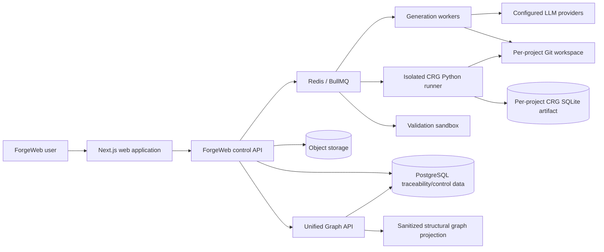
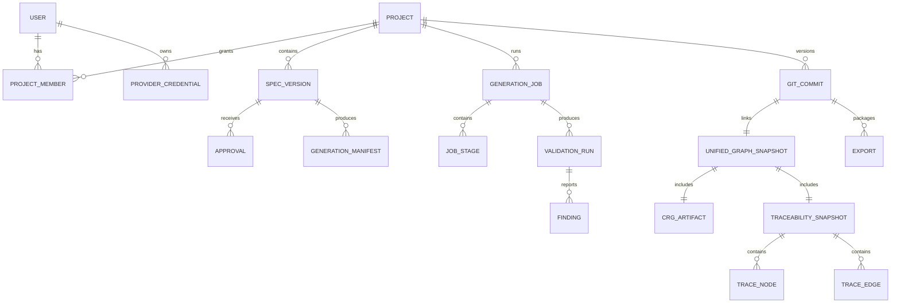
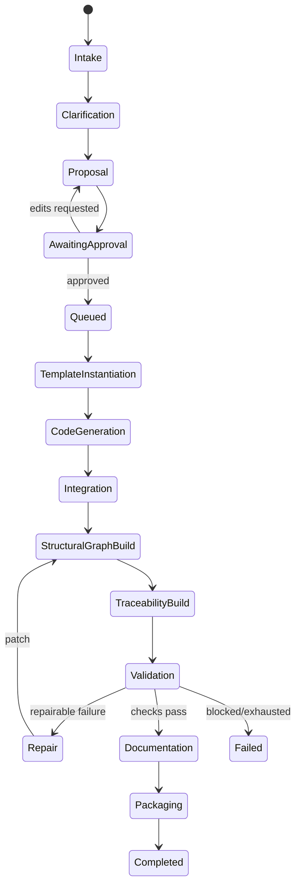
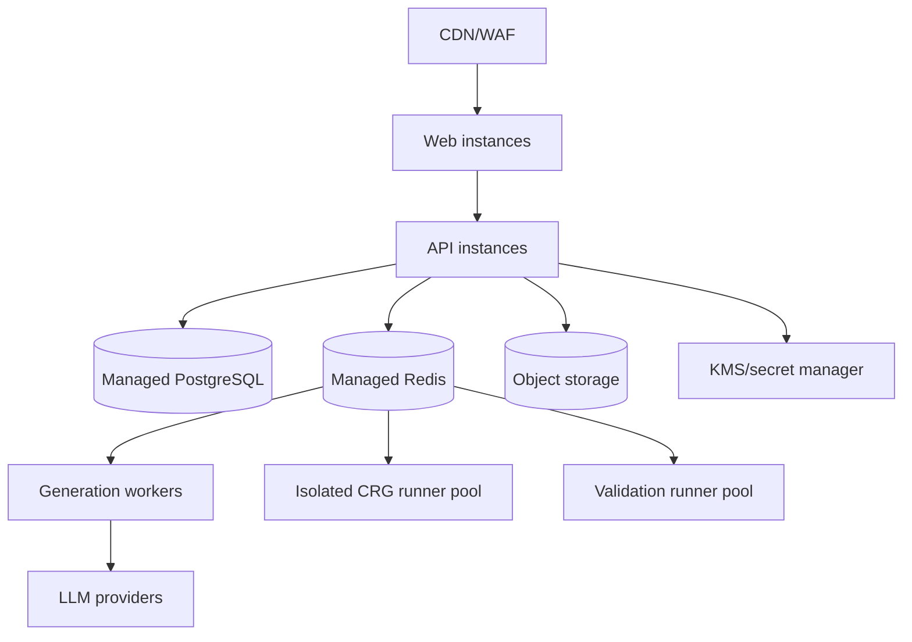
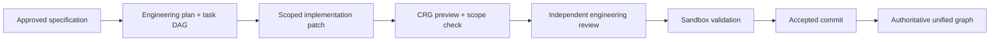

# ForgeWeb Technical Architecture

**Version:** 1.3  
**Status:** Accepted MVP baseline  
**Date:** 2026-08-15  
**Related:** [PRD](./PRD.md) · [Implementation plan](./IMPLEMENTATION_PLAN.md) · [CRG assessment](./architecture/CODE_REVIEW_GRAPH_ASSESSMENT.md) · [Agent operating model](./architecture/AGENT_OPERATING_MODEL.md) · [Karpathy coding discipline](./architecture/KARPATHY_CODING_DISCIPLINE.md)

## 1. Architecture objectives

ForgeWeb must support a small team delivering a secure MVP while retaining safe scale paths. It must make long-running AI work resumable, isolate generated code, preserve the relationship between approved intent and source, use Code Review Graph without confusing structural inference with product truth, and ensure every coding agent follows one bounded senior-engineering discipline.

The platform begins as a **modular monolith with independently scalable workers**. The unified graph is a logical API over two specialized data layers:

1. **CRG structural layer** — code files, symbols, calls, imports, inheritance, tests, communities, and blast radius.
2. **ForgeWeb traceability layer** — requirements, assumptions, approvals, architecture decisions, roles, permissions, controls, generation tasks, findings, and provenance.

## 2. Context and constraints

| Dimension | Accepted assumption | Consequence |
|---|---|---|
| Team | Four-person project team | One monorepo and few operational technologies. |
| Stage | MVP/private beta | Correctness and demonstrability before extreme scale. |
| Initial scale | Below 1,000 users with modest concurrent jobs | PostgreSQL, Redis/BullMQ, and horizontal workers are sufficient. |
| Workload | CRUD control plane plus long AI/build jobs | Synchronous control API, asynchronous workflow. |
| Trust | Prompts, repositories, packages, and generated code are untrusted | Isolated graph and validation runners with no platform secrets. |
| Generated apps | CRUD/business systems first | One versioned reference template first. |
| CRG | Upstream v2.3.7, Python 3.10+, MIT, beta | Pin release; isolate behind adapter and contract tests. |
| Agent model | gstack-informed specialist workflow plus a shared policy derived from `multica-ai/andrej-karpathy-skills` | Keep contracts and pinned source provenance in ForgeWeb; do not embed vendor-specific agent runtimes in generated apps. |

## 3. System context



## 4. Recommended stack

| Layer | Technology | Rationale |
|---|---|---|
| Monorepo | pnpm workspaces + Turborepo | Shared contracts, templates, UI, and tooling. |
| Web | Next.js App Router + React + TypeScript | Strong product shell and React ecosystem. |
| UI | Tailwind + accessible shadcn-compatible primitives | Theme compatibility with selected Motion UI components. |
| Animation | Motion for React; optional licensed Motion UI/AI Kit; wrapped React Bits | Central motion semantics and vendor isolation. |
| Editor | Monaco Editor | File, diagnostics, and diff experience. |
| API | NestJS with Fastify adapter | Explicit modules, guards, validation, and OpenAPI. |
| Workflow | BullMQ + Redis; authoritative state in PostgreSQL | Resumability, retries, concurrency limits, and progress. |
| Control database | PostgreSQL | Strong consistency for projects, approvals, jobs, provenance, and overlay graph. |
| ORM | Prisma or Drizzle selected during bootstrap spike | Typed migrations without premature repository abstraction. |
| Artifacts | S3-compatible object storage | Source snapshots, CRG DBs, reports, logs, and ZIPs. |
| Versioning | Git repository per project | Diffs, accepted commits, external sync, and provenance. |
| Structural graph | Code Review Graph 2.3.7 + per-project SQLite | Proven parser/impact implementation and local-first isolation. |
| Traceability graph | PostgreSQL adjacency tables | Transactional links to product records and approvals. |
| Runners | Ephemeral hardened containers initially | Practical MVP isolation boundary; strengthen before open beta. |
| Observability | OpenTelemetry-compatible traces, logs, metrics, and audit events | Cross-layer correlation. |

## 5. Logical architecture

```mermaid
flowchart TB
    subgraph UX["Experience"]
        Marketing["Marketing"]
        Workspace["Project workspace"]
        Approval["Specification approval"]
        Editor["Monaco editor/diff"]
        Timeline["Generation timeline"]
        GraphUI["Custom React/Motion graph explorer"]
    end

    subgraph Control["Modular control plane"]
        Identity["Identity/tenancy"]
        Projects["Projects/Git"]
        Requirements["Requirements/approvals"]
        Planning["Stack/architecture planning"]
        Workflow["Workflow coordinator"]
        Providers["Provider router/credentials"]
        GraphSvc["Unified Graph service"]
        Validation["Validation policy"]
        Export["Documentation/export"]
        Audit["Audit/usage"]
    end

    subgraph Async["Execution plane"]
        PromptWorker["Prompt/spec worker"]
        PlanWorker["Planning worker"]
        CodeWorker["Template/code worker"]
        CRGWorker["CRG Python runner"]
        OverlayWorker["Traceability/manifest worker"]
        TestWorker["Sandbox validation worker"]
        RepairWorker["Bounded repair worker"]
        DocsWorker["Docs/package worker"]
    end

    subgraph Data["State/artifacts"]
        PG[("PostgreSQL")]
        Redis[("Redis")]
        Objects[("Object storage")]
        Repos[("Project Git workspaces")]
    end

    UX --> Control
    Control --> Async
    Control --> Data
    Async --> Data
```



## 6. Repository structure

```text
forgeweb/
├── apps/
│   ├── web/                       # Next.js
│   ├── api/                       # NestJS control plane
│   └── worker/                    # BullMQ consumers/coordinator
├── services/
│   └── graph-runner/              # Python image wrapping CRG 2.3.7
├── packages/
│   ├── contracts/                 # Versioned runtime schemas
│   ├── domain/                    # Framework-free rules
│   ├── db/                        # PostgreSQL schema/migrations
│   ├── graph/                     # Unified graph ports/projections/invariants
│   ├── providers/                 # LLM adapters/routing
│   ├── workflow/                  # Stage state machine
│   ├── sandbox/                   # Runner/validation ports
│   ├── templates/                 # Generated-app templates/manifests
│   ├── security-policy/           # Protected checks
│   ├── ui/                        # ForgeWeb design-system facade
│   └── observability/             # Correlation/redaction
├── vendor/
│   └── ui/                        # Licensed platform-only source/notices
├── docs/
│   └── architecture/adr/
└── tooling/
```

`packages/templates` cannot import `vendor/ui`. The graph runner image is versioned separately and exposes a ForgeWeb-owned JSON contract.

## 7. Domain modules

| Module | Owns |
|---|---|
| Identity/tenancy | Users, sessions, project authorization, organization roles |
| Projects/versioning | Projects, Git workspaces, commits, diffs, external sync |
| Requirements | Prompt threads, master specifications, assumptions, approvals |
| Planning | Stack eligibility and architecture/data/API/security proposals |
| Workflow | Durable jobs, stages, checkpoints, cancellation, retries |
| Providers | Adapters, routing, token/cost records, credential envelopes |
| Generation | Templates, generation tasks, source patches, repair patches |
| Structural graph adapter | CRG runner requests, artifacts, sanitized projections |
| Traceability graph | Product nodes/edges, manifests, provenance, invariants |
| Unified Graph service | Merge, query, impact policy, user-facing projection |
| Validation | Required checks, findings, pass/fail policy |
| Documentation/export | Docs, provenance, sanitized graph summary, safe ZIP |
| Audit/usage | Immutable audit events, quotas, administrative views |
| Agent coordination | Policy packs, task DAGs, path leases, patch proposals, reviews, acceptance evidence, and bounded retries |

## 8. Core data model



### Provenance records

- `CrgArtifact`: CRG version, runner image digest, source commit, SQLite object key, sanitized projection object key, content digest, build warnings, timings, and node/edge counts.
- `TraceabilitySnapshot`: specification version, generation-manifest digest, overlay graph digest, invariant results, and schema version.
- `UnifiedGraphSnapshot`: accepted commit plus exact structural and traceability snapshot IDs.
- `GenerationManifest`: stable requirement-to-module/file/symbol/API/entity/control/test mappings.
- `ValidationRun`: runner images, policy version, checks, environment manifest, timings, and outcome.

## 9. Unified graph model

### 9.1 Structural layer supplied by CRG

Primary node kinds include `File`, `Class`, `Function`, `Method`, `Type`, and `Test`. Primary edges include `CALLS`, `IMPORTS_FROM`, `INHERITS`, `IMPLEMENTS`, `CONTAINS`, `TESTED_BY`, `DEPENDS_ON`, and `REFERENCES`.

CRG remains responsible for:

- Tree-sitter parsing and language-specific resolvers.
- Incremental file-hash updates and dependent-file reparsing.
- Call/import/test relationships.
- Impact-radius candidate calculation.
- Code communities, flows, hubs, bridges, and structural diagnostics.
- Local structural SQLite storage and diagnostic visualization.

### 9.2 ForgeWeb traceability layer

Node types:

- `Requirement`, `Assumption`, `Decision`
- `Role`, `Permission`, `SecurityControl`
- `Module`, `ApiContract`, `DatabaseEntity`
- `GenerationTask`, `TemplateVersion`, `ValidationCheck`, `Finding`
- `DocumentationSection`, `ExportArtifact`

Edge types:

- `SATISFIES`, `IMPLEMENTS`, `GENERATED_FROM`
- `PERMITS`, `GUARDED_BY`, `VALIDATED_BY`, `TESTED_BY`
- `DEPENDS_ON`, `AFFECTS`, `SUPERSEDES`, `DOCUMENTED_BY`
- `MAPS_TO_STRUCTURAL_NODE`

Structural nodes are addressed by CRG qualified name plus structural snapshot ID. ForgeWeb never assumes a CRG integer row ID is stable across rebuilds.

### 9.3 Unified graph port

```ts
interface UnifiedGraphService {
  buildPreview(input: PreviewBuildInput): Promise<PreviewGraphRef>;
  acceptCommit(input: AcceptedCommitInput): Promise<UnifiedSnapshotRef>;
  impact(input: ImpactQuery): Promise<ImpactResult>;
  validate(snapshotId: string): Promise<GraphInvariantResult>;
  diff(fromSnapshotId: string, toSnapshotId: string): Promise<UnifiedGraphDiff>;
  subgraph(query: UnifiedSubgraphQuery): Promise<SanitizedPortableGraph>;
}
```

### 9.4 Impact algorithm

```mermaid
flowchart LR
    Change["Prompt/manual change"] --> Diff["Git/worktree diff"]
    Diff --> Preview["Debounced CRG preview update"]
    Preview --> Candidate["CRG candidate blast radius/tests"]
    Diff --> Manifest["Requirement manifest/dependency rules"]
    Candidate --> Merge["Merge and risk-expand impact set"]
    Manifest --> Merge
    Merge --> Plan["Regeneration/test plan"]
    Plan --> Approval{"Ambiguous or high risk?"}
    Approval -- Yes --> Human["User approval"]
    Approval -- No --> Execute["Execute scoped changes"]
    Human --> Execute
    Execute --> Commit["Accepted Git commit"]
    Commit --> Authoritative["Fresh authoritative CRG build"]
    Authoritative --> Invariants["Unified graph invariants + validation"]
```



CRG results are conservative candidate evidence, never the sole authority. ForgeWeb expands the set for manifest dependencies, authentication/authorization changes, database migrations, shared contracts, template policy changes, and uncertain parser coverage.

### 9.5 Invariants

- Every approved requirement is implemented, deferred, or rejected with a reason.
- Every protected endpoint maps to authentication, authorization, validation, and negative tests.
- Every database write maps to an approved workflow and integration test.
- Every generated file maps to a template, generation task, or accepted manual edit.
- Every manifest structural reference resolves in the authoritative CRG snapshot.
- No removed structural node remains referenced by traceability edges.
- Critical/high blocking findings prevent validated export.
- The CRG artifact, overlay snapshot, source commit, and specification version digests agree.

## 10. CRG runner integration

### 10.1 Execution model

- Pin `code-review-graph==2.3.7` in the Python runner lockfile.
- Run one isolated ephemeral graph process/container per project operation.
- Materialize the exact project commit and prior CRG SQLite artifact into the runner workspace.
- Invoke a ForgeWeb-owned Python adapter using CRG's library API or local stdio MCP; do not expose CRG HTTP directly to users.
- Pass explicit repository root on every request.
- Disable cloud/local embeddings for MVP.
- Export a sanitized JSON projection and updated SQLite artifact.
- Store artifacts in project-scoped object storage; destroy the runner workspace.

### 10.2 Preview versus authoritative builds

| Mode | Trigger | Storage | Purpose |
|---|---|---|---|
| Preview | Debounced browser save/change batch | Short-lived object/cache; not accepted provenance | Fast candidate impact and UI feedback |
| Authoritative | Accepted Git commit | Immutable object with digest and metadata | Validation, history, export provenance |
| Full rebuild | First build, incompatible CRG/schema change, stale/corrupt artifact | Replaces authoritative artifact only after checks | Restore consistency |

### 10.3 Sanitization

CRG JSON can contain absolute local paths and structural metadata. Before leaving the runner:

- Convert paths to normalized project-relative POSIX paths.
- Reject paths outside the materialized repository.
- Strip source snippets unless explicitly required and authorized.
- Remove runner paths, environment details, credentials, and embedding configuration.
- Cap graph response depth/nodes/tokens.
- Validate against ForgeWeb's versioned structural-projection schema.

### 10.4 Compatibility tests

- Exact CRG version and Python version are recorded.
- Golden TypeScript/TSX fixture produces expected nodes, edges, tests, and impact set.
- Incremental update matches a clean full rebuild on fixture digests/projection.
- Deleted/moved files disappear correctly.
- Absolute paths never reach the API/export.
- Runner fails closed on parse/build errors or unsupported output schema.

## 11. Master specification and generation manifest

The master specification stores stable IDs for personas, roles, requirements, entities, workflows, APIs, controls, and tests. Generation tasks consume IDs rather than copied prose.

The generation manifest contains:

```text
manifest_version
specification_version
template_versions[]
requirements[] -> modules/files/symbols/tests
roles[] -> permissions/endpoints/policies/tests
entities[] -> schema files/models/migrations/APIs/tests
security_controls[] -> implementations/configuration/tests
generation_tasks[] -> changed artifacts/provider calls
```

Parsers verify structural references against CRG. Model inference may propose ambiguous mappings, but acceptance requires deterministic evidence or human approval.

## 12. Generation workflow



Each stage has an immutable input reference, schema version, idempotency key, budgets, sanitized progress events, hashed outputs, checkpoint, cancellation behavior, and audit record.

## 13. Sandbox and validation

### Runner properties

- Exact commit materialized in an ephemeral workspace.
- Non-root process, read-only base image, workspace-only writes.
- CPU, memory, process, disk, and wall-clock limits.
- Network disabled by default; allowlisted dependency proxy with lockfiles when required.
- No platform database, queue, object-store, provider, or KMS credentials exposed.
- Restricted capabilities/syscalls; no host sockets or privileged mode.
- Artifact path, size, type, and symlink validation.

### Validation order

1. Provenance and manifest schema.
2. Format, lint, and type checks.
3. Locked dependency resolution.
4. Build and migration checks.
5. Unit tests.
6. API/database integration tests.
7. Browser E2E tests.
8. Static security analysis.
9. Dependency vulnerability/license analysis.
10. Secret scanning.
11. Targeted dynamic security checks.
12. CRG/traceability invariants and requirement coverage.
13. Documentation and export completeness.

Repair is limited to three rounds by default. Protected security policy cannot be weakened without explicit approval.

## 14. Security architecture

Major threats include prompt injection, malicious source/package scripts, sandbox escape, resource exhaustion, cross-project access, credential leakage, supply-chain attacks, SSRF, unsafe ZIPs, raw CRG path leakage, and repairs that remove tests.

Controls include:

- Deny-by-default server authorization.
- Maintained authentication/session library; no custom cryptography.
- Encrypted credential envelopes backed by managed keys in production.
- Redaction before logs, traces, providers, graph projections, and exports.
- Project-scoped storage and runner identities.
- Signed/allowlisted templates and pinned dependencies.
- Isolated CRG and build/test execution.
- Structured tool calls and runtime schemas.
- Immutable validation policy.
- Audit events for approvals, credentials, calls, exports, Git sync, and administration.
- Rate limits/quotas per user, project, provider, and job.

## 15. API surface

```text
POST   /projects
GET    /projects/:projectId
POST   /projects/:projectId/prompt-turns
POST   /projects/:projectId/specifications/draft
POST   /projects/:projectId/specifications/:version/approve
POST   /projects/:projectId/generation-jobs
GET    /generation-jobs/:jobId
POST   /generation-jobs/:jobId/cancel
GET    /generation-jobs/:jobId/events
GET    /projects/:projectId/files
PUT    /projects/:projectId/files/*path
GET    /projects/:projectId/diffs/:commit
POST   /projects/:projectId/graph/previews
GET    /projects/:projectId/graph
GET    /projects/:projectId/graph/impact
GET    /projects/:projectId/graph/diffs
GET    /projects/:projectId/validation-runs
POST   /projects/:projectId/exports
POST   /projects/:projectId/git/connections
POST   /projects/:projectId/git/pull
POST   /projects/:projectId/git/push
```

Use SSE for one-way generation progress. WebSockets are deferred until collaborative editing exists.

## 16. UI architecture

```text
feature/page
  -> ForgeWeb design-system component
     -> accessible primitive + Motion wrapper
        -> quarantined vendor component where approved
```

- Custom graph explorer consumes sanitized unified graph JSON.
- CRG D3 HTML visualization is restricted to diagnostic/admin workflows.
- Central motion tokens define `snap`, `ui`, `gentle`, `lively`, and `ambient` behavior.
- Heavy effects are route-level lazy imports.
- Vendor source, versions, licenses, modifications, and notices are inventoried.
- Vendor source is excluded from generated templates and ZIPs.

## 17. Deployment topology



Web/API, workers, CRG runners, and validation runners are separate deployment units while sharing the monorepo/contracts.

## 18. Reliability and consistency

- PostgreSQL is authoritative for control/workflow state; Redis is not.
- Use an outbox to dispatch stage work after transactions.
- Stage handlers are idempotent and verify artifact hashes.
- A commit is accepted only with structural artifact, traceability snapshot, and invariant results.
- Object artifacts are immutable/content-addressed where practical.
- Cancellation uses cooperative signals plus hard runner termination.
- External Git conflicts are explicit; force-push is not default.

## 19. Observability

Propagate:

```text
request_id -> project_id -> job_id -> stage_id -> agent_run_id -> agent_task_id
           -> agent_attempt_id -> provider_call_id / runner_id -> patch_id -> review_id
           -> commit_id -> crg_artifact_id -> unified_snapshot_id -> validation_run_id
```

Measure API health, queue depth/age, provider usage/cost, runner resource use, blocked egress, CRG build/update duration and warnings, structural node/edge counts, overlay invariant failures, impact-set size, validation outcomes, and export provenance completeness.

## 20. Decisions and revisit triggers

| Decision | Chosen | Trade-off | Revisit trigger |
|---|---|---|---|
| System shape | Modular monolith + workers | Shared release cadence | Team/domain scaling proves extraction necessary |
| Structural graph | Pinned CRG 2.3.7 adapter | Python runtime and upstream compatibility work | CRG no longer meets accuracy/security/maintenance needs |
| Unified graph | CRG + PostgreSQL overlay | Merge/query complexity | A verified single engine safely supports both domains |
| CRG execution | Per-project isolated runner | Runner startup/artifact overhead | Proven secure multi-tenant service reduces cost materially |
| Updates | Debounced preview + authoritative commit | Two graph states | Preview cost/UX evidence favors commit-only |
| Embeddings | Disabled MVP | Weaker semantic search | User research proves value and privacy/cost controls exist |
| Graph UI | Custom React + diagnostic D3 | UI development effort | Existing visualization satisfies product UX/accessibility |
| Generation | Templates + AI | Supported envelope | Verified unconstrained generation becomes equally reliable |
| Vendor UI | Platform-only | Generated apps need separate design system | Builder/redistribution licensing is obtained |
| Agent execution | Bounded provider-neutral specialist roles | Coordinator/evidence overhead | One-agent or standard protocol proves equally safe and cheaper |
| gstack adoption | Workflow reference through ForgeWeb policy packs | Some upstream features require adaptation | Provider-neutral runtime integration becomes verifiably valuable |
| Karpathy discipline | Pinned upstream guidance translated into a ForgeWeb policy pack | Upstream improvements require manual review and regression tests | A better measured policy preserves the same safety and scope guarantees |

## 21. Validation checklist

- [x] Requirements and constraints are explicit.
- [x] CRG source, license, release, storage, APIs, limits, and security model were assessed.
- [x] Simpler alternatives and trade-offs are documented.
- [x] Significant decisions have ADRs.
- [x] Source-of-truth and graph-consistency rules are explicit.
- [x] Untrusted code and graph parsing have isolation boundaries.
- [x] Vendor UI and raw CRG artifacts are excluded from customer export.
- [x] Agent roles, scopes, write isolation, review independence, evidence, and bounded failure behavior are explicit.
- [x] gstack adoption preserves provider neutrality and does not change generated-application dependencies.
- [x] The Karpathy policy source, adoption boundary, precedence, enforcement gates, and controlled update process are explicit.
- [ ] Hosting-specific runner design has passed security review.
- [ ] Actual scale, budget, and academic delivery date are confirmed.
- [ ] First generated-application stack passes the template spike.

## 22. Disciplined multi-agent engineering

ForgeWeb implements agent collaboration inside the existing workflow module rather than adding one service per role. The coordinator converts an approved specification and implementation plan into typed tasks with immutable inputs, path/tool permissions, change budgets, acceptance criteria, validation steps, and risk classifications.

The default MVP flow is sequential:



Additional product, design, test, security, and documentation specialists activate only when task type or risk requires them. Parallel implementation requires isolated worktrees or overlays, the same immutable base commit, and disjoint write-path leases. Shared contracts, migrations, authentication, authorization, dependencies, and global configuration remain serialized.

Every role follows the same rules derived from [`multica-ai/andrej-karpathy-skills`](https://github.com/multica-ai/andrej-karpathy-skills): surface assumptions, select the simplest sufficient solution, touch only required code, remove only orphans created by the task, investigate before repair, and loop against explicit evidence. ForgeWeb pins the reviewed source revision and translates it into a versioned policy pack. An implementation agent cannot approve its own patch, weaken a failing test, expand its scope, or report validated status.

gstack supplies the workflow reference—framing, engineering plan review, implementation, adversarial review, QA, ship readiness, and retrospective learning. The Karpathy policy supplies the shared execution discipline across those roles. ForgeWeb translates both into versioned provider-neutral contracts and does not require gstack, the upstream skill runtime, Claude Code, Bun, or user-level state at runtime.

The complete role catalog, contracts, state machine, security model, CRG integration, test strategy, and rollout are defined in [ForgeWeb Disciplined Multi-Agent Operating Model](./architecture/AGENT_OPERATING_MODEL.md). The behavioral contract is defined in [ForgeWeb Karpathy Coding Discipline](./architecture/KARPATHY_CODING_DISCIPLINE.md). The architecture decision is recorded in [ADR-006](./architecture/adr/ADR-006-disciplined-multi-agent-orchestration.md).
