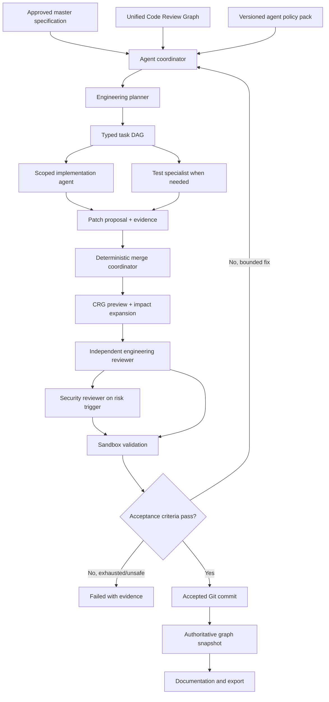
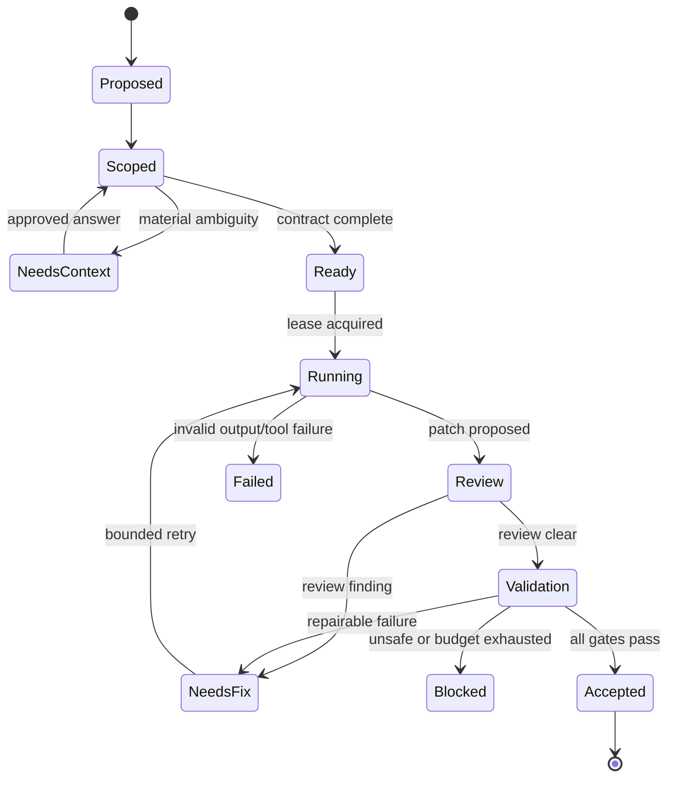

# ForgeWeb Disciplined Multi-Agent Operating Model

**Version:** 1.1  
**Status:** Accepted design extension  
**Date:** 2026-08-15  
**Related:** [PRD](../PRD.md) · [Architecture](../ARCHITECTURE.md) · [Implementation plan](../IMPLEMENTATION_PLAN.md) · [Karpathy coding discipline](./KARPATHY_CODING_DISCIPLINE.md) · [ADR-006](./adr/ADR-006-disciplined-multi-agent-orchestration.md)

## 1. Purpose

ForgeWeb uses multiple specialized agents to plan, implement, review, validate, document, and package generated applications. The objective is not to simulate a large team or maximize the number of agents. The objective is to apply the smallest set of independent engineering roles needed to produce a bounded, reviewable, evidence-backed change.

Every agent follows one shared engineering discipline:

1. state material assumptions before editing;
2. prefer the simplest implementation that satisfies the approved specification;
3. change only the files and behavior required by the assigned task;
4. define observable success criteria and a validation plan before implementation;
5. investigate failures before proposing fixes;
6. stop on ambiguity that changes scope, security, data, or architecture;
7. never self-certify consequential work without independent evidence.

This model adopts the caution, simplicity, surgical-change, and goal-driven principles defined by [`multica-ai/andrej-karpathy-skills`](https://github.com/multica-ai/andrej-karpathy-skills) and operationalized in the [ForgeWeb Karpathy Coding Discipline](./KARPATHY_CODING_DISCIPLINE.md). It also adapts the specialist lifecycle demonstrated by [`garrytan/gstack`](https://github.com/garrytan/gstack): product framing, engineering planning, implementation, independent review, QA, release, and retrospective learning.

## 2. Adoption boundary

ForgeWeb adopts gstack as a **workflow and quality-gate reference**, not as the product runtime contract.

- ForgeWeb does not require Claude Code, Bun, shell-specific helpers, or a user-level gstack installation.
- ForgeWeb does not copy gstack skills into generated customer applications.
- ForgeWeb represents the useful workflow as versioned, provider-neutral `AgentPolicyPack` and `AgentTask` contracts.
- Upstream gstack may be used by ForgeWeb's own engineering team under its MIT license, but product behavior cannot depend on unversioned global configuration or telemetry files.
- gstack upgrades are reviewed for useful workflow changes; they do not silently change generation behavior.

The result preserves model/provider portability and keeps customer exports free of platform-only orchestration code.

The Karpathy guidelines are adopted through the same boundary: ForgeWeb pins a reviewed upstream revision and digest, translates the four principles into its own `AgentPolicyPack`, and runs policy-conformance fixtures. The upstream skills are not copied into generated applications, and upstream changes cannot silently change active behavior. gstack defines the workflow layer; the Karpathy discipline applies the shared coding behavior across every role.

## 3. Non-goals

- An unbounded autonomous swarm.
- Agents negotiating scope through unrestricted peer-to-peer conversation.
- Majority voting as a substitute for tests or product approval.
- Multiple agents editing the same worktree concurrently.
- Persisting private chain-of-thought or raw hidden reasoning.
- Letting an implementation agent approve its own security-sensitive change.
- Automatically deploying generated applications in the MVP.
- Replacing deterministic tools, templates, parsers, or tests with model judgment.

## 4. System shape



The coordinator is part of the existing workflow module in the modular monolith. Agents execute through isolated workers. A new microservice is not introduced for each role.

## 5. Role catalog

Roles are capabilities selected per task, not permanent personas that must all run.

| Role | Responsibility | Write authority | Required when |
|---|---|---|---|
| Product clarifier | Converts ambiguous intent into decision-oriented questions and stable requirement IDs | Specification draft only | Material product ambiguity exists |
| Product critic | Challenges scope and user value without silently expanding it | Review record only | New product or major feature; optional for routine changes |
| Engineering planner | Defines architecture, data flow, task DAG, risks, acceptance criteria, and test plan | Plan and ADR proposal only | Every generation or material change |
| Design reviewer | Defines interaction states, accessibility, responsive behavior, and design-system constraints | Design review record only | User-facing UI changes |
| Implementation agent | Applies one bounded task against an explicit file/tool scope | Patch proposal only | Task has ready dependencies |
| Test specialist | Adds or reviews tests from acceptance criteria and failure modes | Test patch proposal only | Critical behavior or missing coverage |
| Engineering reviewer | Reviews the merged diff, architecture fit, edge cases, and test adequacy | Review record only | Every accepted change |
| Security reviewer | Reviews trust boundaries, auth, data, dependencies, migrations, secrets, and sandbox effects | Review record only | Risk policy triggers it |
| QA agent | Exercises actual behavior and records reproducible evidence | Test artifacts; fixes require a new task | User-visible or integration behavior changes |
| Documentation/release agent | Produces docs, provenance, changelog, and safe package | Documentation/package paths only | Validation passes |
| Retrospective learner | Proposes durable workflow learnings from verified outcomes | Project-scoped learning proposal only | After accepted work or repeated failure |

The engineering planner is the required plan gate. Product, design, and security review are conditional. This mirrors gstack's staged specialization while avoiding unnecessary agent cost for trivial changes.

## 6. Shared task contract

Every agent receives a runtime-validated contract instead of a conversational handoff.

```ts
type AgentTask = {
  taskId: string;
  projectId: string;
  jobId: string;
  role: AgentRole;
  objective: string;
  specificationVersion: string;
  baseCommit: string;
  requirementIds: string[];
  dependencyTaskIds: string[];
  inputArtifactRefs: string[];
  graphSliceRef: string;
  allowedPaths: string[];
  forbiddenPaths: string[];
  allowedTools: string[];
  changeBudget: {
    maxFiles: number;
    maxAddedLines: number;
    maxDeletedLines: number;
  };
  acceptanceCriteria: AcceptanceCriterion[];
  validationPlan: ValidationStep[];
  riskClass: "low" | "standard" | "high" | "critical";
  tokenBudget: number;
  wallClockBudgetMs: number;
  attemptLimit: number;
  policyPackVersion: string;
  policySourceRevision: string;
  policySourceDigest: string;
};
```

An agent cannot widen `allowedPaths`, change approved requirements, increase its budget, or weaken validation policy. It returns a proposal:

```ts
type AgentResult = {
  taskId: string;
  status: "completed" | "needs_context" | "blocked" | "failed";
  assumptions: AssumptionRecord[];
  changedPaths: string[];
  patchArtifactRef?: string;
  diffDigest?: string;
  evidenceRefs: string[];
  acceptanceResults: AcceptanceResult[];
  unresolvedRisks: RiskRecord[];
  followUpProposals: FollowUpProposal[];
  providerExecutionRef: string;
};
```

`followUpProposals` are never implemented automatically unless they are required to satisfy the current approved task and pass coordinator scope checks.

## 7. Karpathy-aligned execution discipline

This section summarizes the runtime rules. Their normative ForgeWeb contract, precedence, enforcement gates, metrics, and upstream-update process are defined in [ForgeWeb Karpathy Coding Discipline](./KARPATHY_CODING_DISCIPLINE.md).

### 7.1 Think before coding

Before a task enters `RUNNING`, the planner must record:

- exact behavior to change and behavior to preserve;
- assumptions with confidence and evidence source;
- the simplest viable approach;
- at least one rejected alternative when the decision is architectural;
- acceptance criteria observable by tests, builds, graph invariants, or user approval;
- risk triggers and rollback strategy.

If an unanswered question changes scope, data ownership, permissions, external effects, or architecture, the task becomes `NEEDS_CONTEXT`. Cosmetic or reversible implementation detail may use the documented project default.

### 7.2 Simplicity first

- Start from an approved template or existing concrete implementation.
- Do not create an abstraction for a single use unless policy requires a boundary.
- Do not add optional configuration, fallback layers, services, or packages without a requirement.
- Prefer deterministic code and tools over another model call.
- A change-budget overrun returns to planning; it is not silently accepted.

### 7.3 Surgical changes

- Each changed line must map to a task objective, acceptance criterion, generated artifact rule, or necessary orphan cleanup caused by the patch.
- Pre-existing unrelated code is not reformatted, refactored, renamed, or deleted.
- Shared contracts, migrations, authentication, authorization, and dependency files are protected paths requiring elevated review.
- Parallel write tasks must have disjoint path leases. Read-only reviews may run concurrently.

### 7.4 Goal-driven verification

- Tests are derived from acceptance criteria before implementation.
- A successful command without expected assertions is not evidence.
- The implementation agent may report completion, but only validation policy can report `validated`.
- Every failed attempt records the failure class and changed evidence; repeating the same unmodified attempt is prohibited.

## 8. Planning and dispatch

The engineering planner produces a directed acyclic task graph. A task is dispatchable only when:

1. every dependency is accepted;
2. its base commit matches the current integration commit;
3. its input artifacts and graph slice are current;
4. its write paths do not conflict with another active lease;
5. its acceptance criteria are machine-checkable or have a named human gate;
6. the selected agent/provider supports the required tools and context size.

Parallelism is selective:

- safe: separate documentation, isolated feature modules, read-only review, independent test analysis;
- serialized: shared contracts, database migrations, dependency manifests, authentication, authorization, global styles, and the same files;
- prohibited: two agents directly editing one shared worktree.

Each implementation agent works from the same immutable base commit in an isolated worktree or overlay filesystem and returns a patch artifact. The merge coordinator applies patches in task order, rechecks preconditions, and rejects stale or conflicting proposals.

## 9. Review and acceptance gates



Required gates:

1. **Scope gate** — task stays within approved requirements and path/change budgets.
2. **Engineering review** — architecture, edge cases, failure modes, tests, and maintainability.
3. **Conditional design/security review** — activated by risk and change classification.
4. **Sandbox validation** — format, types, build, migrations, tests, security, dependency, secret, and graph checks as applicable.
5. **Provenance gate** — specification, tasks, patches, reviews, evidence, commit, and graph digests link correctly.
6. **Human gate** — required for approved-spec changes, high-risk ambiguity, protected policy changes, unresolved warnings, and external Git/release actions.

An implementation agent cannot satisfy the engineering-review gate for its own patch. A repair agent cannot delete or weaken the test that exposed the failure unless the test itself is independently proven incorrect and approved.

## 10. Code Review Graph integration

The unified graph supplies context and verifies agent work; it does not become an autonomous editor.

Before execution:

- resolve requirement IDs to candidate modules, files, symbols, APIs, entities, controls, and tests;
- combine CRG impact candidates with manifest dependencies and policy expansion;
- create a bounded graph slice and record its structural snapshot/version;
- derive protected paths and candidate tests.

After every merged patch:

- run a debounced or explicit preview CRG update;
- compare actual changed nodes/edges with the declared task scope;
- expand validation when unexpected dependents appear;
- reject unresolved manifest references or forbidden path changes;
- record `PERFORMED_BY`, `REVIEWED_BY`, and `VALIDATED_BY` traceability edges.

After acceptance, an authoritative CRG build is linked to the accepted commit. Preview graph evidence cannot certify a release.

## 11. Persistence model

New control-plane records:

- `AgentRun`: one orchestration run linked to job, spec, policy pack, and base commit;
- `AgentTask`: typed objective, role, scope, budgets, criteria, dependencies, and state;
- `TaskLease`: worker identity, path lease, expiry, and heartbeat;
- `AgentAttempt`: provider/model, tool policy, timing, usage, output status, and redacted diagnostics;
- `PatchProposal`: base commit, patch object, changed paths, diff digest, and apply result;
- `ReviewRecord`: reviewer role, findings, severity, evidence, and disposition;
- `AcceptanceResult`: criterion, check, evidence artifact, and outcome;
- `AgentLearning`: project-scoped, sanitized, reviewable operational guidance with source and confidence.

Only concise decision summaries, structured assumptions, diffs, tool results, and evidence are retained. Private chain-of-thought is neither requested nor stored.

## 12. Context and memory policy

- Context is assembled from the approved specification, task contract, current files, graph slice, relevant tests, policies, and prior attempt summaries.
- Agents do not receive the complete repository when a smaller verified slice is sufficient.
- Source from one project is never used as memory for another project.
- Durable learning must be a short, verifiable project fact or workflow rule, not model speculation.
- A learning that changes architecture, security, or product behavior requires review and versioning.
- Raw prompts marked private and provider responses are excluded from customer export.

## 13. Security and tool policy

- Agent outputs are untrusted until runtime schema validation and policy checks pass.
- Tools are deny-by-default and scoped per role and task.
- Agents receive capability handles, never raw platform credentials.
- Shell, package installation, network access, Git push, deployment, destructive filesystem operations, and secret access require explicit policy and isolation.
- Prompt content, repository instructions, dependency scripts, and web content cannot override system/task policy.
- High/critical tasks require independent security review and complete affected validation.
- All provider context is redacted and limited to the approved project slice.

## 14. Failure handling

| Failure | Response |
|---|---|
| Material ambiguity | Pause task as `NEEDS_CONTEXT`; ask one decision-oriented question |
| Stale base commit or graph slice | Invalidate lease and replan/rebase; never apply blindly |
| Patch exceeds scope/budget | Reject patch and return to planning |
| Conflicting patches | Serialize, recompute impact, and regenerate the later patch |
| Tool/provider timeout | Retry only when idempotent and budget permits; otherwise checkpoint |
| Repeated same failure | Stop the loop and escalate with attempt evidence |
| Reviewer disagreement | Evidence and policy decide; unresolved consequential judgment goes to user |
| Graph degraded | Preserve source access, expand validation, and block authoritative graph claims |
| Validation failure | Bounded focused repair; never relabel as success |
| Suspicious output | Quarantine artifacts and terminate exposed credentials/capabilities |

## 15. API and event outline

```text
POST /projects/:projectId/agent-runs
GET  /agent-runs/:runId
GET  /agent-runs/:runId/tasks
GET  /agent-runs/:runId/events
POST /agent-tasks/:taskId/answer
POST /agent-tasks/:taskId/cancel
GET  /agent-tasks/:taskId/evidence
GET  /projects/:projectId/review-readiness
```

Key events:

```text
agent.run.planned
agent.task.ready
agent.task.started
agent.task.needs_context
agent.patch.proposed
agent.patch.rejected
agent.review.completed
agent.validation.completed
agent.task.accepted
agent.run.blocked
agent.run.completed
```

Events carry identifiers and status, not hidden reasoning or sensitive source content.

## 16. Observability and quality metrics

Track:

- first-pass task acceptance rate;
- median patch size versus task budget;
- scope-rejection and stale-patch rates;
- cross-agent conflict rate;
- review findings by severity and escape rate;
- retries by failure class;
- test-selection recall against final authoritative impact;
- tokens, cost, latency, and tool use by role;
- requirement-to-task-to-patch-to-test traceability completeness;
- human-question rate and percentage that materially changed the plan;
- generated code later removed as unnecessary.

The target is not maximum agent activity. A healthy system uses fewer agents and smaller patches as task clarity and templates improve.

## 17. Verification strategy

### Contract tests

- Invalid task/result schemas fail closed.
- Allowed-path and change-budget violations are rejected.
- A stale patch cannot apply to a changed base commit.
- Parallel tasks with overlapping write leases cannot run.
- Provider adapters produce the same normalized task/result contract.

### Workflow tests

- Low-risk single-file change uses planner, one implementer, reviewer, and targeted validation.
- UI change activates design review and accessibility/browser checks.
- Auth or migration change activates security review and full affected validation.
- Agent failure resumes from a checkpoint without repeating accepted work.
- Repair stops at its configured attempt/budget limit.

### Adversarial tests

- Repository prompt injection attempts to widen tools or reveal secrets.
- An implementation agent claims success without evidence.
- A repair removes a failing test or authorization control.
- Two agents propose conflicting edits to a protected contract.
- A graph slice omits a dynamic dependency and policy expansion catches it.
- Cross-project context, artifacts, task IDs, and learnings remain isolated.

## 18. MVP rollout

1. Implement contracts, states, budgets, and one coordinator inside the workflow module.
2. Support one engineering planner, one implementation agent at a time, independent reviewer, and sandbox validator.
3. Add CRG-assisted context slicing and post-patch scope verification.
4. Add conditional test, design, and security specialist roles.
5. Permit parallel implementation only after path leases and stale-patch tests pass.
6. Add project-scoped retrospective learnings only after redaction and review controls pass.

The MVP does not begin with multi-agent parallelism. Correct task boundaries and evidence flow are validated first.

## 19. Acceptance criteria

The operating model is ready for private beta when:

1. every accepted patch links to an approved task, spec version, base commit, reviewer, validation evidence, and authoritative graph snapshot;
2. no agent can write outside its path lease or use a tool outside its policy;
3. engineering review is independent and required for every accepted code change;
4. critical/high risk triggers security review and complete affected validation;
5. bounded retries terminate with an honest blocked/failed result;
6. conflicting agents cannot corrupt the shared repository;
7. a representative change demonstrates smaller context and validation sets than full regeneration without losing required test coverage;
8. generated exports contain no platform agent runtime, private memory, credentials, or chain-of-thought.

## 20. Primary references

- [andrej-karpathy-skills repository](https://github.com/multica-ai/andrej-karpathy-skills)
- [Karpathy Guidelines skill](https://github.com/multica-ai/andrej-karpathy-skills/blob/main/skills/karpathy-guidelines/SKILL.md)
- [andrej-karpathy-skills README](https://github.com/multica-ai/andrej-karpathy-skills/blob/main/README.md)
- [gstack repository and README](https://github.com/garrytan/gstack)
- [gstack agent role catalog](https://github.com/garrytan/gstack/blob/main/AGENTS.md)
- [gstack skill deep dives](https://github.com/garrytan/gstack/blob/main/docs/skills.md)
- [gstack router and completion protocol](https://github.com/garrytan/gstack/blob/main/SKILL.md)
- [Code Review Graph repository](https://github.com/tirth8205/code-review-graph)
